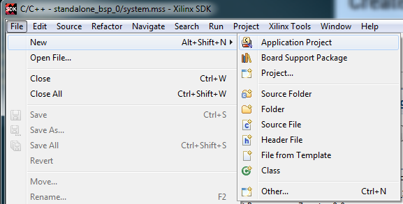
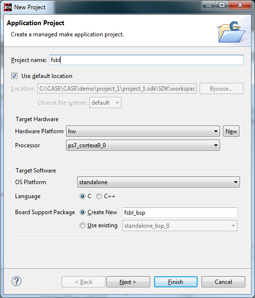
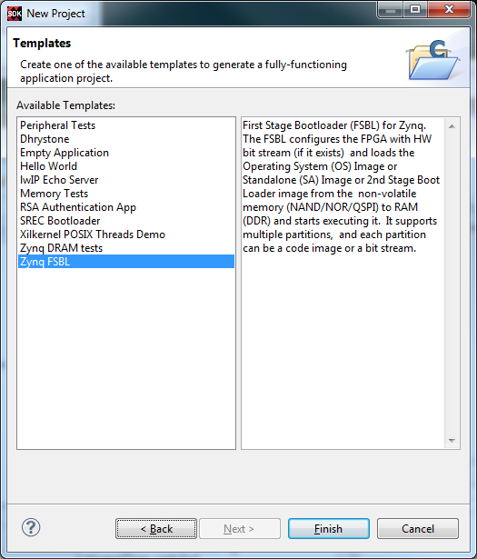
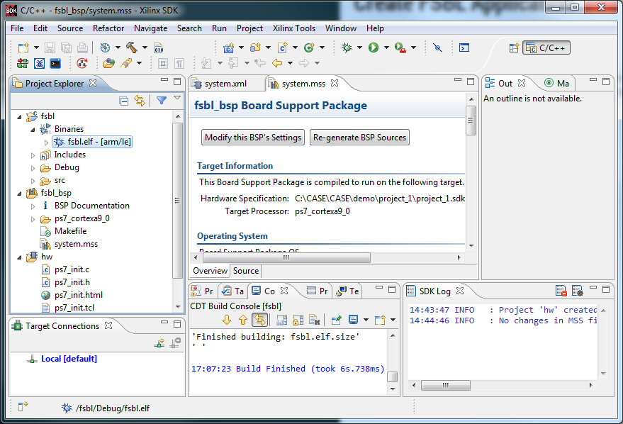

# Create FSBL Application

- Prerequests:
  - hardware platform has been imported
- Demo Version: 2014.1

## GUI Flow
### Create a New Application Project

### Setup Project Name and New BSP Name

### Select FSBL in the Tempalte

Optional: If the system doesn't use PS side DDR, apply the modification in [AR56044](http://www.xilinx.com/support/answers/56044.html)

### Final FSBL Elf

