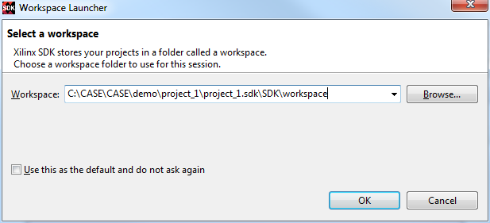
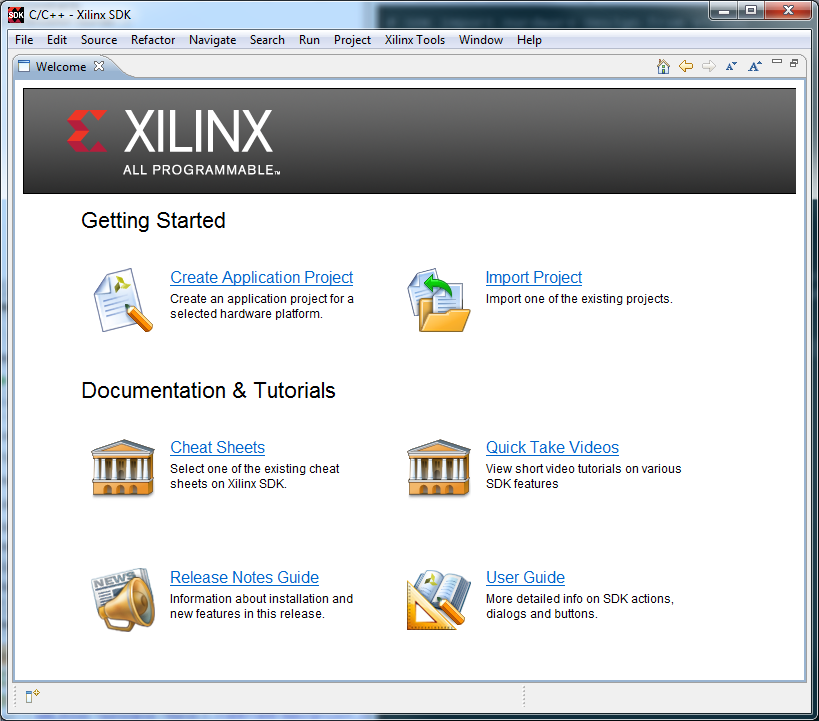
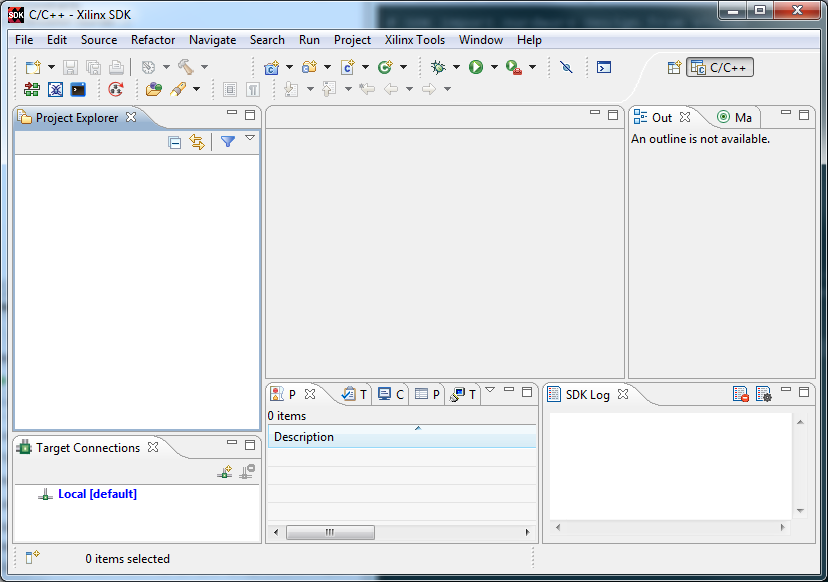

# SDK Import Hardware Design from Vivado

- Prerequests: 
  - Block Design has been exported
- Demo version: Vivado 2014.1

## GUI Flow

### Open SDK

### Select Workspace Location

Workspace location can be set to anywhere. A directory named "workspace" at the parallel level of "Vivado project\project.sdk\SDK\SDK_Export" is prefered.

### SDK Welcome Page

### Empty Workspace
Close the Welcome page, it shows an empty workspace.

### Import Hardware
