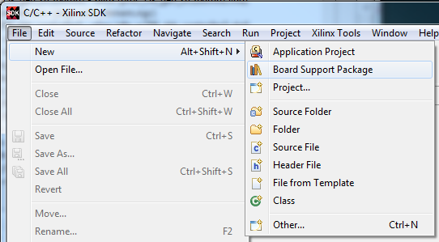
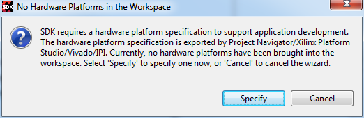
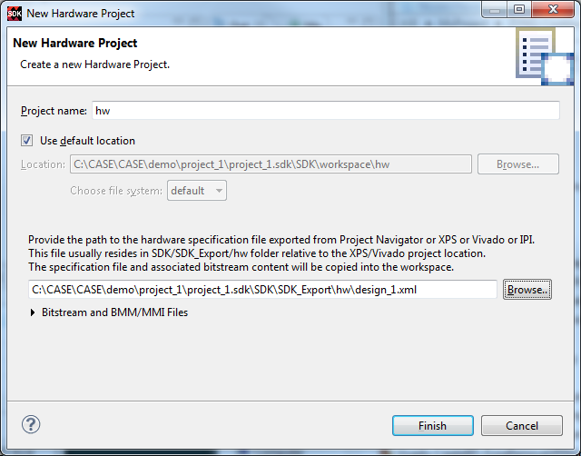
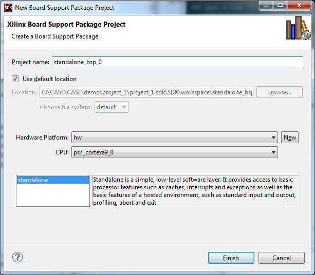
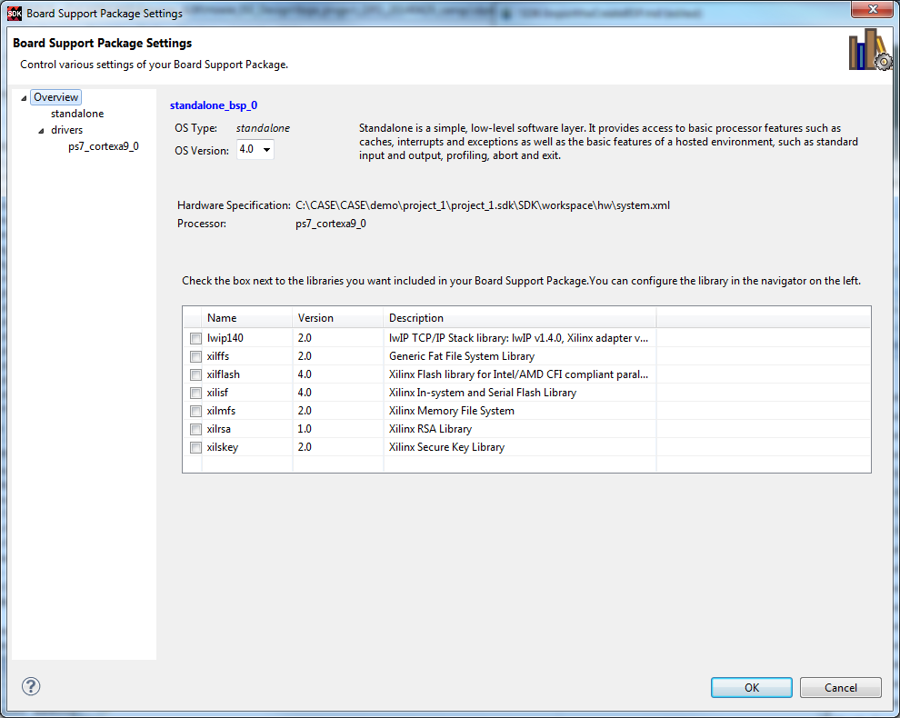
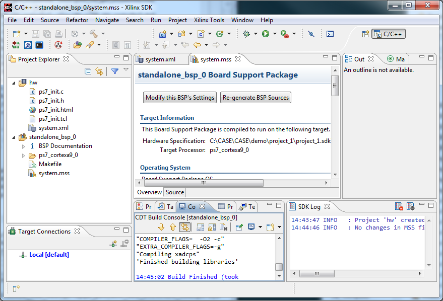

# Import Hardware and Create Standalone BSP

- Prerequests: 
  - Exported hardware xml file
- Demo version: Vivado 2014.1

## GUI Flow
### Create New BSP

### Specify Hardware Platform

### New Hardware Project

### Setup Standalone BSP

### Set BSP Properties

### The Final BSP Is Compiled Automatically
