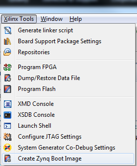
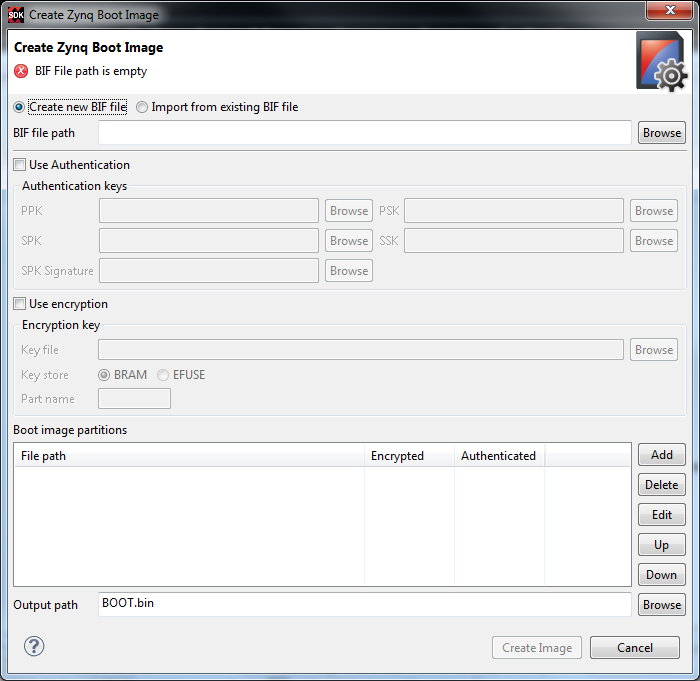
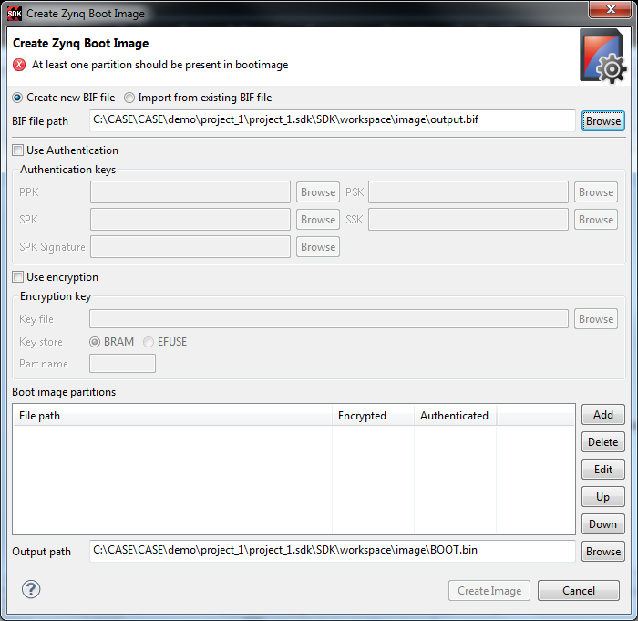
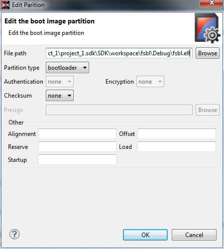
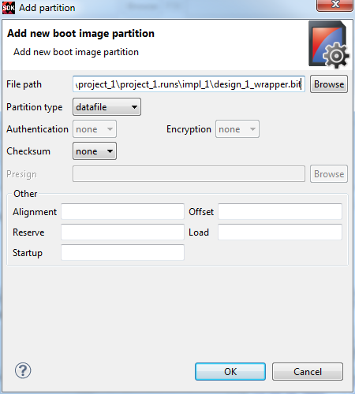
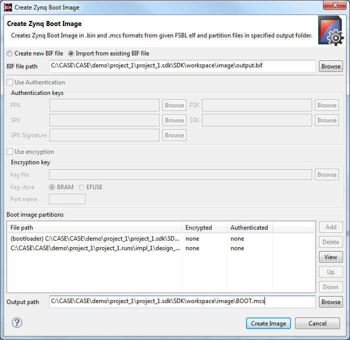

# Prepare ZYNQ Boot Image with FSBL and Bit

- Prerequests: 
  - Hardware has been imported to SDK
  - FSBL has been compiled
  - Bit file has been generated
- Demo version: Vivado 2014.1

## GUI Flow
### Xilinx Tools -> Create ZYNQ Boot Image


### Get Initial Window


### Set BIF Path


### Add FSBL Image


### Add Bit File


### Modify Output Path and File Name


The suffix of the output file can be either`bin` or `mcs`. Bin file is in binary and mcs file is in ASCII. MCS is used by the SDK Flash Programmer.

## Command Flow
Command
```
bootgen -image <description.bif> -o i <output.mcs>
```

Example of bif file
```
the_ROM_image:
{
	[bootloader]C:\CASE\CASE\demo\project_1\project_1.sdk\SDK\workspace\fsbl\Debug\fsbl.elf
	C:\CASE\CASE\demo\project_1\project_1.runs\impl_1\design_1_wrapper.bit
}
```

## References
[SDK Help for Create ZYNQ Boot Image](http://www.xilinx.com/support/documentation/sw_manuals/xilinx2014_1/SDK_Doc/tasks/sdk_t_create_zynq_boot_image.htm)