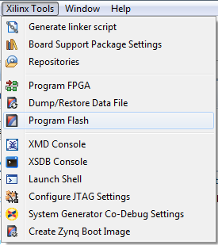
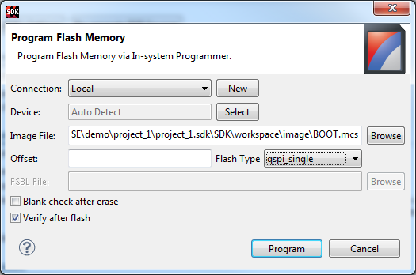

# Program Flash with SDK

- Prerequests: 
  - Hardware has been imported by SDK
  - Flash image has been created
- Demo version: Vivado 2014.1

## GUI Flow

### Launch Program Flash Tool from SDK Menu


### Setup Program Flash Tool


- Set Image file location
- Leave offset blank
- Select Flash Type
- Select Verify after flash can check whether programming is successful

## Command
```
zynq_flash -f \
C:\CASE\CASE\demo\project_1\project_1.sdk\SDK\workspace\image\BOOT.mcs -offset 0 \
-flash_type qspi_single -verify -cable type xilinx_tcf url TCP:127.0.0.1:3121 
```