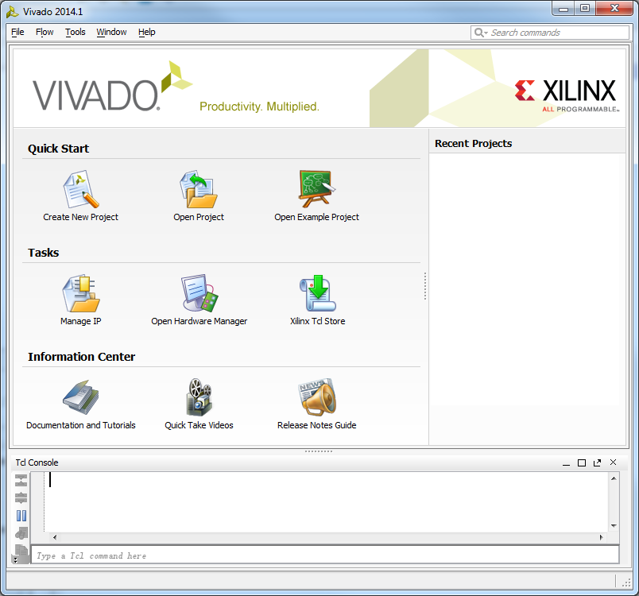
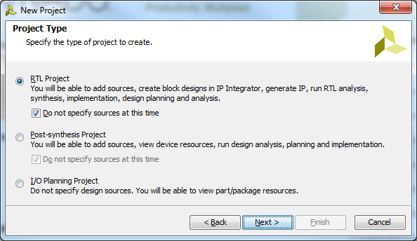
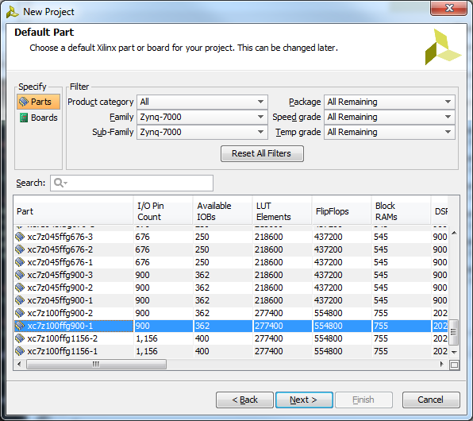
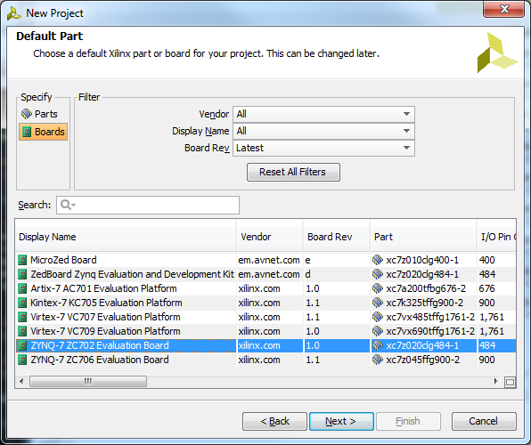
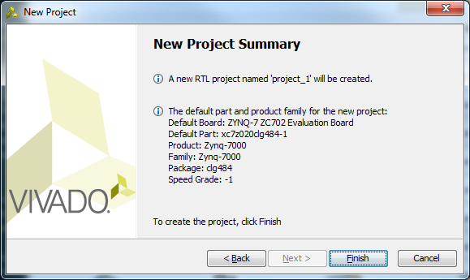
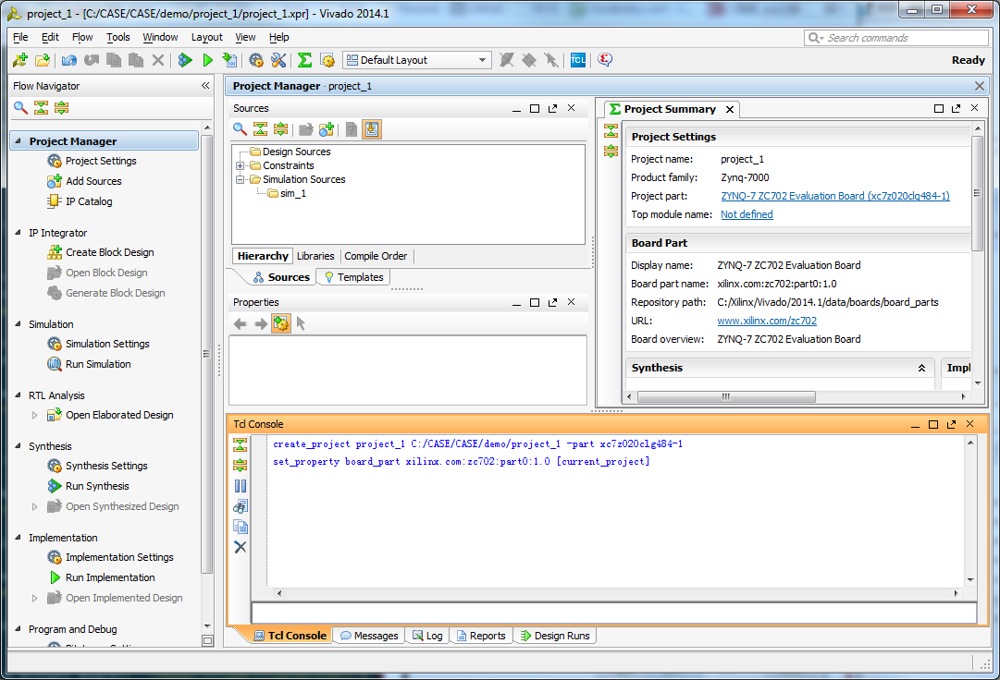

# Create a Project in Vivado

- Prerequests: None
- Demo version: Vivado 2014.1

## Work Flow
### Launch Vivado on Windows


### Launch Vivado on Linux
```bash
source /opt/Xilinx/Vivado/2014.1/settings64.sh
# /opt/Xilinx is the installation directory of Vivado
vivado &
# & means launch the tool and enable more commands in this shell
```

### Vivado Startup Window


### Create New Project
Input Project Name and Location


Select RTL Project for projects with HDL as top module



Select Project Part with the help of filters



If Xilinx demo boards are used, go to `Boards` and select the board.



Review the project summary



Click Finish then get the created project.
