# Create a ZYNQ only BD Design without DDR

- Prerequests: 
  - Vivado project has been created.
- Demo version: Vivado 2014.1


###Design Target

- Processor: ZYNQ
- No further IP connected
- Disable DDR Controller
- Enable QSPI Flash so that ZYNQ can boot PL from QSPI

## GUI Work Flow

### Create Block Design
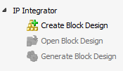

### Set BD Name
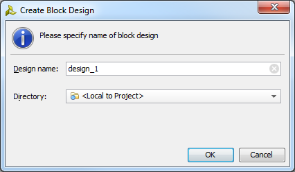

### Add IP in BD
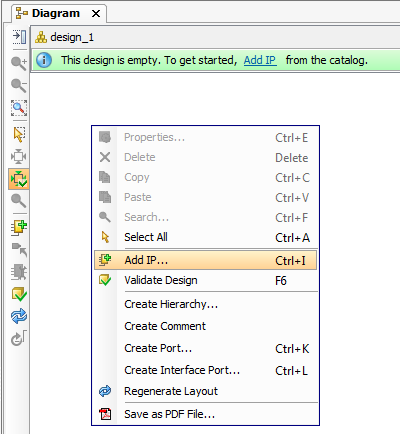

### Add ZYNQ
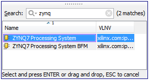

### ZYNQ Default Block
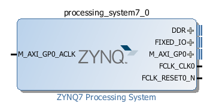

### Double Click ZYNQ Block to Configure ZYNQ
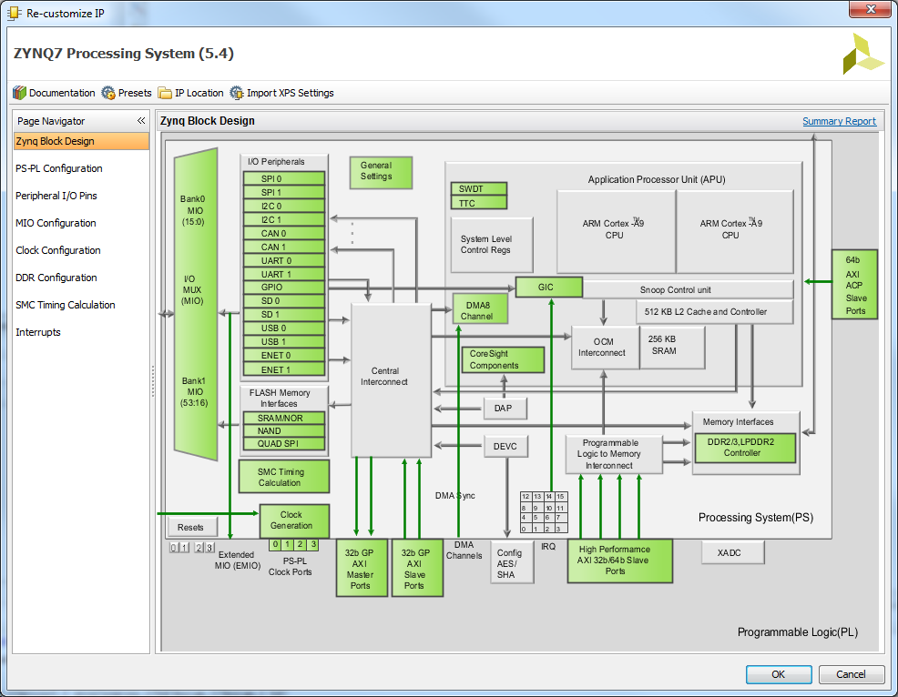

### Remove FCLK Output
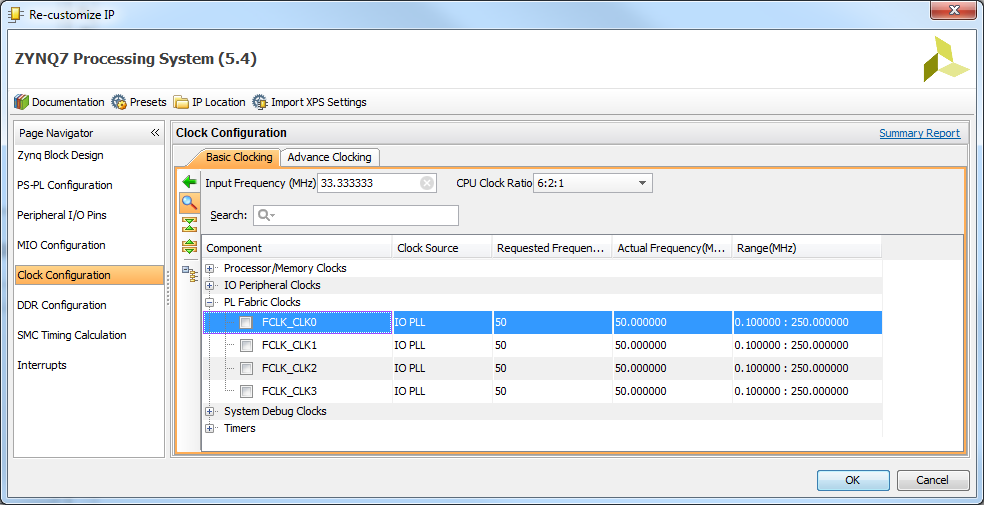

### Remove AXI Master GP0
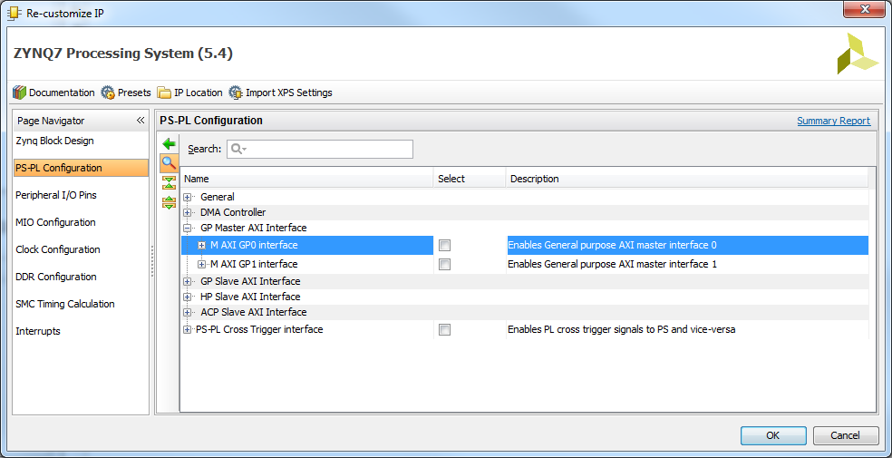

### Disable DDR Controller
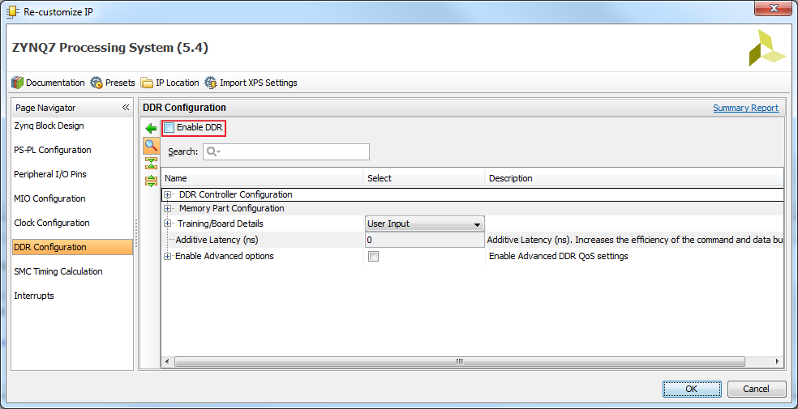

### Enable QSPI Controller
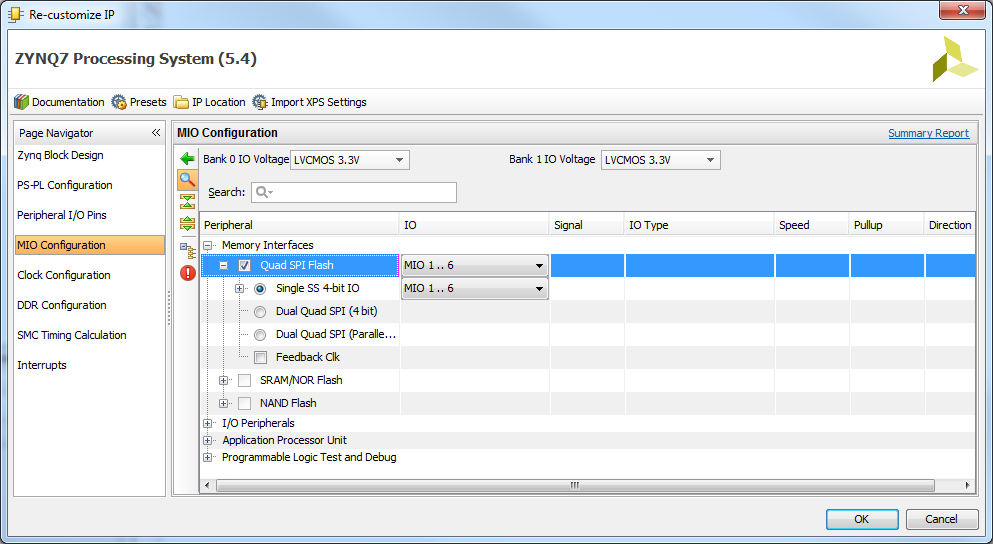

### Make Ports External
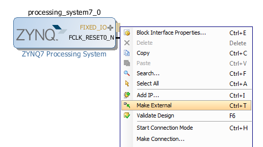

### Final ZYNQ Block Configuration
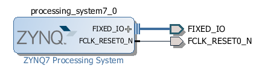

### Save Design
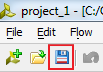


## Tcl
```tcl
set_property -dict [list CONFIG.PCW_USE_M_AXI_GP0 {0} CONFIG.PCW_EN_CLK0_PORT {0} CONFIG.PCW_UIPARAM_DDR_ENABLE {0}  CONFIG.PCW_QSPI_PERIPHERAL_ENABLE {1}] [get_bd_cells processing_system7_0]
create_bd_intf_port -mode Master -vlnv xilinx.com:display_processing_system7:fixedio_rtl:1.0 FIXED_IO
connect_bd_intf_net [get_bd_intf_pins processing_system7_0/FIXED_IO] [get_bd_intf_ports FIXED_IO]
create_bd_port -dir O -type rst FCLK_RESET0_N
connect_bd_net [get_bd_pins /processing_system7_0/FCLK_RESET0_N] [get_bd_ports FCLK_RESET0_N]
save_bd_design
```