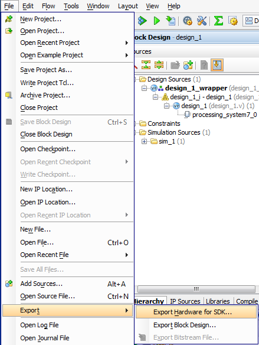

# Export to SDK

- Prerequests: 
  - Output products of Block Design has been generated
  - Top module of the design has been asigned
- Demo version: Vivado 2014.1

## GUI Flow

### Export Hardware for SDK Menu



## Tcl
```tcl
export_hardware [get_files <bd file path>]
```