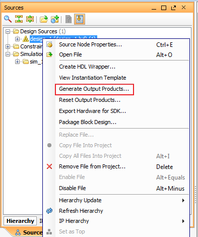
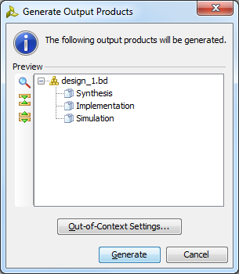
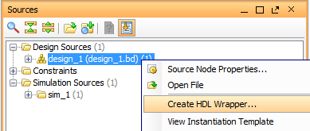
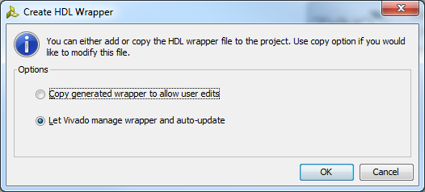
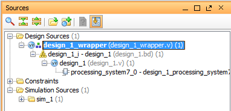

# Generate Output Products for Block Design and Create HDL Wrapper

- Prerequests: 
  - Block Design has been created
- Demo version: Vivado 2014.1

### Design Target
- Use `Generate Output Products` command to generate the files that would be used in synthesis and simulation.
- Use `Create HDL Wrapper` to create an HDL top module so that the design can run through the synthesis and implementation process.

## GUI Flow

### Generate Output Products

### Select Generate

### Generate HDL Wrapper

### Let Vivado Manage

When letting Vivado manage the wrapper, the wrapper will be automatically updated during the "Generate Output Products" stage when the interface of block design is changed.

### Final Design Source Structure
